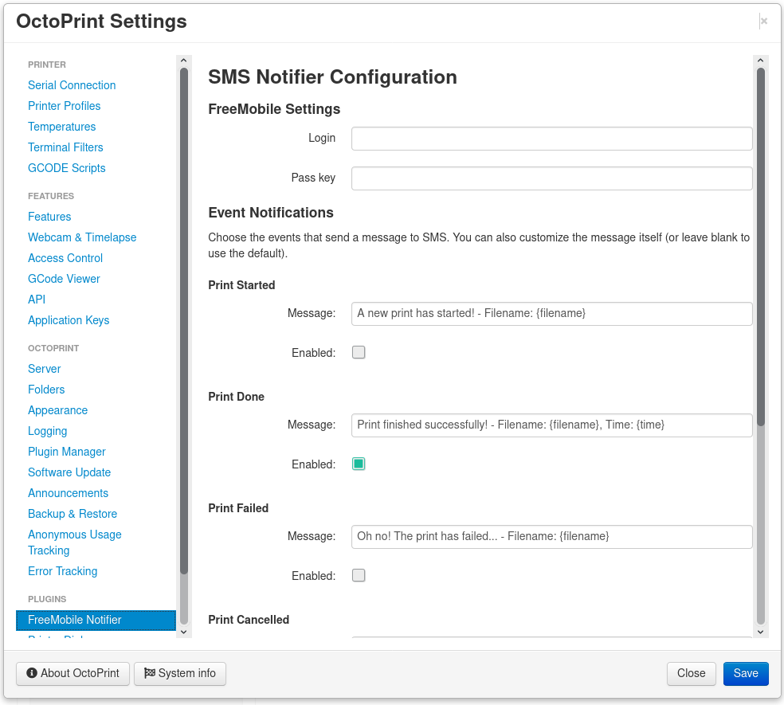

# OctoPrint_FreeMobile-Notifier

Recieve SMS notifications when OctoPrint jobs are complete.

## Setup

Install via the bundled [Plugin Manager](https://github.com/foosel/OctoPrint/wiki/Plugin:-Plugin-Manager)
or manually using this URL:

    https://github.com/Pinaute/OctoPrint_FreeMobile-Notifier/archive/master.zip

## Configuration

You will need to be subscribers to the Free Mobile offer. Make sure that you activate the SMS notification in your subscriber space.

## Acknowledgements

Loosely based on [OctoPrint-EmailNotifier](https://github.com/anoved/OctoPrint-EmailNotifier)

## License

Licensed under the terms of the [AGPLv3](http://opensource.org/licenses/AGPL-3.0).
